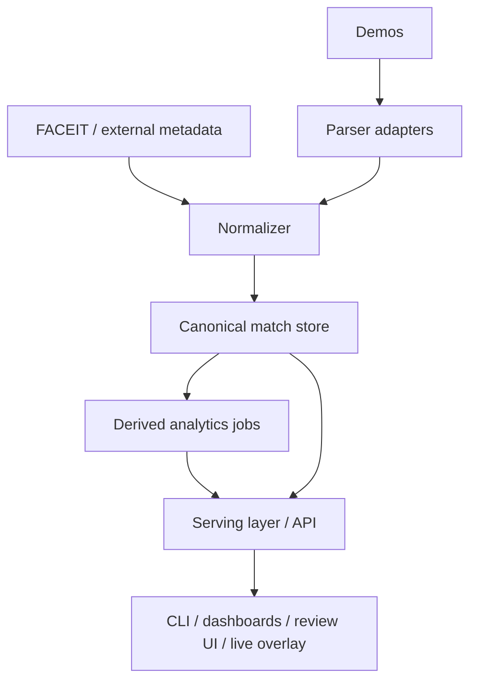

# Architecture for a Team-Grade CS Demo Intelligence Platform

This document describes the intended long-term architecture for this Rust project.

The project is **not** just a demo parser clone.
Its long-term goal is to support:

- personal data collection and research
- FACEIT/pro/semi-pro demo ingestion
- team scouting and opponent preparation
- analyst workflows
- manual review tools
- rich visualizations
- eventually, a live synchronized UI layered on top of a demo review session

## Product framing

The product can be thought of as four systems that share one canonical data model:

1. **Ingestion system**
   - parse demos
   - import external metadata
   - normalize and deduplicate
2. **Analytics system**
   - derive reusable tactical and player metrics
   - compute team tendencies and situational performance
3. **Review system**
   - help humans inspect rounds, positions, utility, and context
   - support manual tagging and overrides
4. **Presentation system**
   - dashboards
   - scouting reports
   - synchronized review UI
   - eventually live overlays tied to demo playback

## Guiding principles

### 1. Use a canonical domain model
The parser should map into your own model, not directly into a database schema and not directly into the UI.

### 2. Treat parsing as only one source of truth
The final truth for a match may combine:

- demo parser output
- FACEIT or league metadata
- public match records
- analyst annotations
- manual corrections
- derived classifications

### 3. Keep raw data and derived data separate
You want to preserve the original parse while allowing improved logic later.

### 4. Version derived logic
Classifying strategies, defaults, saves, utility protocols, and situational tendencies will evolve.
Each classifier should be versioned so results can be recomputed cleanly.

### 5. Design for reprocessing
You will eventually improve parsing, tagging, linking, and analytics logic.
The system should make re-running those stages normal and safe.

## Suggested system layers

## Proposed workspace direction

Over time, the workspace can grow into crates like these:

- `crates/csda-core`
  - canonical domain model
  - parser-facing types
  - shared enums and errors
- `crates/csda-parser-source2`
  - adapter for the real CS2 demo parser
- `crates/csda-ingest`
  - normalization, dedupe, enrichment pipeline
- `crates/csda-storage`
  - Postgres access and persistence logic
- `crates/csda-analytics`
  - derived features, classifiers, tendency calculations
- `crates/csda-api`
  - HTTP/WebSocket API for UI clients
- `crates/csda-cli`
  - batch tools, debugging, export, backfill
- optional future UI project
  - Tauri shell or web frontend

This split keeps the parser, storage, analytics, and presentation concerns independent.

## Data flow stages

### Stage 1: Raw ingestion
Input:
- `.dem` files
- optional external metadata

Output:
- raw parse artifacts
- demo checksum
- parser version
- basic canonical match object

Examples of raw entities:
- players
- teams if detectable
- rounds
- kills
- bomb events
- utility events
- economy snapshots
- positions / trajectories if you choose to store them

### Stage 2: Normalization
Purpose:
- stable IDs
- consistent timestamps
- side normalization
- team/player linking
- source provenance

Examples:
- resolve player identity with `steam_id`
- link a demo to a FACEIT match ID
- standardize team names
- detect map / match metadata inconsistencies

### Stage 3: Enrichment
Purpose:
- add context not present in the demo

Examples:
- competition / event / season / league
- match date and opponent metadata
- roster context
- manual notes
- analyst labels

### Stage 4: Derived analytics
Purpose:
- transform events into tactical insight

Examples:
- buy / force / eco / save classification
- opening duel patterns
- site hit timing clusters
- retake performance in XvY situations
- utility protocols by spawn or side
- default tendencies by timestamp window
- clutch and postplant behavior

### Stage 5: Review serving
Purpose:
- expose structured and time-synchronized data to a UI

Examples:
- round timeline
- player pathing overlays
- utility and damage timeline
- round-state filter queries
- synced clips / bookmarks / notes

## Tactical intelligence model

For team scouting, raw events are not enough.
You will want three categories of data.

### A. Event data
These are objective things the parser or external source can observe.

Examples:
- kills
- damage
- flashes
- smokes
- molotovs
- bomb plant / defuse
- money and equipment snapshots
- player positions over time

### B. State data
These represent the context of the round at a moment in time.

Examples:
- alive count by side
- utility remaining
- economy state
- map control estimate
- bomb status
- site occupancy
- player spacing

These are especially important for answering questions like:
- how good is a player in 2v3 CT retakes?
- how often does a team save in 3v4 with low kit availability?
- when does a team convert a 5v4 into a site finish?

### C. Classification data
These are higher-level interpretations.
They may be heuristic or model-based.

Examples:
- buy type: full / force / half / eco
- round archetype: default / fast exec / contact / split / late hit / fake
- utility protocol labels
- save decision labels
- setup labels on CT
- rotation pattern labels

These should be stored with:
- classifier version
- confidence score if applicable
- provenance

## Recommendation: event-sourced enough for replay, relational enough for analytics

A practical hybrid approach:

### Keep relational tables for analytics
Use Postgres for:
- matches
- players
- rounds
- kills
- damages
- utility events
- bomb events
- player-round stats
- derived situation tables

### Keep optional denser time-series blobs for replay/review
For heavy or frequent state snapshots, consider:
- compressed JSON blobs per round
- binary segment files
- later, columnar/event-log storage if needed

This prevents the database from becoming painful while still allowing rich review features.

## Live review / overlay implications

If you want a UI synchronized with demo playback, plan for a timeline-first API.

The UI will eventually need queries like:
- give me all events from round 8 between tick 10200 and 11800
- show smoke trajectories and active durations
- show current alive players and equipment at tick T
- show notes and tags attached to this round/time window
- render prior tendency stats while reviewing this round

So the backend should think in terms of:
- `match_id`
- `round_number`
- `tick`
- time-window queries
- precomputed round summaries

## Situational analytics examples to design for

These are good examples of future derived tables or materialized views.

### Team tendencies
- T-side buy tendencies by map and score state
- CT save frequency by man-disadvantage and site
- A/B site pressure timing by map
- utility usage by round phase
- exec timing distributions
- opening duel locations and success rate

### Player tendencies
- retake success in XvY situations
- clutch win rate by side and site
- anchor survival and trade rate
- entry pathing and duel frequency
- utility efficiency
- reaction to lost map control

### Opponent prep outputs
- common pistol-round protocols
- default map control timings
- preferred late-round save thresholds
- common postplant setups
- player tendencies under pressure

## Classification strategy

Some features can be directly parsed.
Many of the most valuable scouting features cannot.

So build a classifier pipeline from the start.

Examples of classifier families:
- `economy_classifier`
- `situation_classifier`
- `site_hit_classifier`
- `save_decision_classifier`
- `setup_classifier`
- `strategy_classifier`

Each classifier should:
- consume canonical data
- emit explicit labels
- include a `version`
- be rerunnable
- be independently testable

## Manual analyst workflow support

A team-grade tool should assume analysts will correct or augment data.

Support these concepts early:
- notes on match / round / event / player
- tags for rounds or tactical patterns
- override tables for metadata mismatches
- manually linked external match IDs
- bookmarkable moments in the timeline

This is important because some tactical interpretations will always require human review.

## Scalability guidance

### Start simple
For v1, Postgres is enough.
Do not prematurely optimize into distributed systems.

### Separate parse cost from analytics cost
Parsing demos is expensive and special.
Derived analytics are expensive in a different way.
Treat them as separate jobs.

### Make reprocessing explicit
You should be able to say:
- re-run parser on a demo
- re-run enrichment on a match set
- re-run only the save classifier version 3
- rebuild scouting aggregates for a team and map pool

### Avoid overcoupling UI to raw parser details
The UI should consume stable view models or API responses, not direct parser internals.

## Near-term recommended roadmap

### Phase 1: parser foundation
- keep `csda-core`
- integrate a real CS2 parser adapter
- support players, rounds, kills, bomb events, basic utility events

### Phase 2: storage foundation
- add Postgres schema
- persist canonical matches and event tables
- add ingestion provenance tables

### Phase 3: first analytics
- economy classification
- save/buy decision logic
- simple XvY situation extraction
- opening duel summaries

### Phase 4: review features
- per-round timeline data
- notes and tags
- API for UI consumption
- synchronized event query model

### Phase 5: scouting-grade outputs
- strategy classification
- map tendencies
- player reaction profiles
- report generation and dashboards

## Minimum viable design decisions to preserve now

Even before the parser is complete, the project should preserve these design assumptions:

1. canonical domain model first
2. database schema separate from parser structs
3. all derived analytics versioned
4. provenance tracked for important fields
5. time/tick-based access patterns treated as first-class
6. manual overrides and annotations expected, not bolted on later
7. UI consumes stable API/view models, not parser-native types

## Concrete next implementation target

The most useful next coding step is:

1. add `csda-storage`
2. define a first Postgres schema for canonical match/event data
3. add ingestion provenance tables
4. reserve space for manual overrides and analyst notes
5. then integrate a real parser adapter into `csda-core`

That path keeps the project aligned with both your personal DB goals and future team-scouting/product ambitions.
