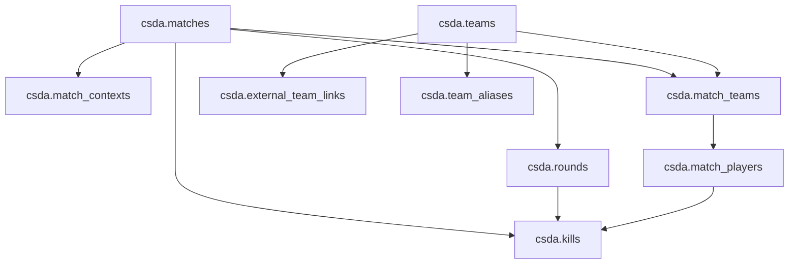
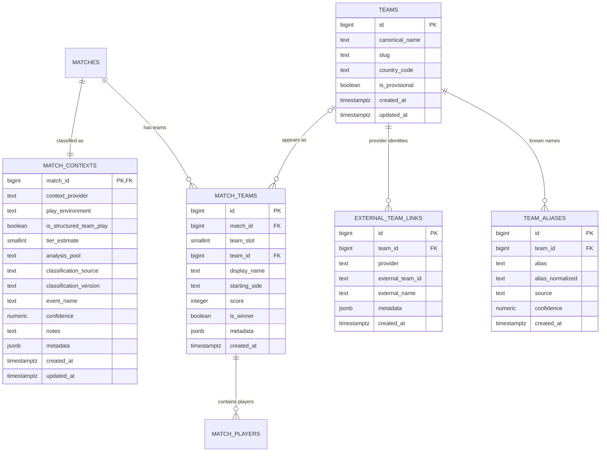

# `0002` Schema Proposal: Teams and Match Context

This document proposes the **next schema iteration** after `0001_initial.sql`.

The goal is to add the missing model pieces needed for:

- team-first scouting workflows
- separating structured team play from FACEIT/pug/casual data
- better future strategy classification
- cleaner UI/report filtering
- more reliable enrichment from external providers such as HLTV and FACEIT

This is a **design-first** proposal.
It is not implemented yet.

---

## Short answer: can HLTV classify teams?

**Yes, often — but not by itself, and not for everything.**

HLTV is likely your strongest external enrichment source for:

- canonical team identity in the pro/semi-pro scene
- event names and match context
- roster context
- high-signal tournament matches
- rough competitive tier estimation

But HLTV should be treated as **one provider**, not the only source of truth, because:

- there is no stable official public API that you should assume as a guaranteed contract
- most practical integrations rely on scraping or unofficial wrappers
- coverage is much better for pro/semi-pro than for FACEIT, scrims, mixes, and low-tier data
- a team being known on HLTV does **not** automatically mean every match involving that team belongs in a structured strategic pool

So the design should be:

- **use HLTV to enrich canonical teams and match context when available**
- **store provenance for that enrichment**
- **allow manual overrides**
- **keep your own internal match classification fields**

---

## Why this schema round should happen next

The current schema is good for first-pass ingestion of:

- matches
- players
- rounds
- kills

But it is missing the concepts that matter most for the product direction:

- team identity
- match-level team representation
- structured-vs-unstructured match classification
- analysis pool routing

Without those, adding more events like utility or damage would increase storage volume without fixing the model that makes the data strategically useful.

---

## Design goals for `0002`

1. Make **teams** first-class entities.
2. Represent a team **inside a specific match** separately from global team identity.
3. Track **external team/provider links** cleanly.
4. Add **match context classification** so analytics can be routed by signal quality and match type.
5. Avoid splitting into separate databases too early.
6. Keep a clean path from low-confidence/raw ingestion to high-confidence curated scouting data.

---

## Recommended conceptual model

Instead of separate databases for pro vs FACEIT/casual, use:

- **one canonical event store**
- **one team model**
- **one match classification model**
- **multiple analysis pools**

That means:

- all matches can still be ingested into one schema
- structured/pro analytics can target only the right pool
- player-centric analytics can still include FACEIT/pug data
- low-signal data can remain queryable without polluting scouting outputs

---

## Proposed new tables

## 1. `csda.teams`

Canonical team identity.

Suggested fields:

- `id bigserial primary key`
- `canonical_name text not null`
- `slug text not null`
- `country_code text`
- `is_provisional boolean not null default false`
- `created_at timestamptz not null default now()`
- `updated_at timestamptz not null default now()`

Notes:

- `is_provisional` is useful when you infer a team from parser/external data but do not trust the identity fully yet.
- `slug` is for your own normalized identity, not copied directly from any one provider.

---

## 2. `csda.external_team_links`

Maps a canonical internal team to an external provider ID.

Suggested fields:

- `id bigserial primary key`
- `team_id bigint not null references csda.teams(id) on delete cascade`
- `provider text not null`
- `external_team_id text not null`
- `external_name text`
- `metadata jsonb`
- `created_at timestamptz not null default now()`

Suggested constraints:

- `unique (provider, external_team_id)`
- `provider in ('hltv', 'faceit', 'manual', 'other')`

Why this is better than storing `hltv_team_id` directly on `teams`:

- you will likely have multiple providers over time
- some teams may exist only in certain provider ecosystems
- it keeps your internal identity independent from external systems

---

## 3. `csda.team_aliases`

Stores alternate or observed team names.

Suggested fields:

- `id bigserial primary key`
- `team_id bigint not null references csda.teams(id) on delete cascade`
- `alias text not null`
- `alias_normalized text not null`
- `source text not null`
- `confidence numeric(4,3)`
- `created_at timestamptz not null default now()`

Suggested constraints:

- `source in ('hltv', 'faceit', 'parser', 'manual', 'other')`
- `unique (team_id, alias_normalized, source)`

Why this matters:

- team names vary across demos and platforms
- academy teams, stand-ins, and short names create ambiguity
- you want matching logic without mutating canonical names constantly

---

## 4. `csda.match_teams`

Represents the two teams inside a specific match.

Suggested fields:

- `id bigserial primary key`
- `match_id bigint not null references csda.matches(id) on delete cascade`
- `team_slot smallint not null`
- `team_id bigint references csda.teams(id)`
- `display_name text not null`
- `starting_side text not null default 'unknown'`
- `score integer`
- `is_winner boolean`
- `metadata jsonb`
- `created_at timestamptz not null default now()`

Suggested constraints:

- `team_slot in (1, 2)`
- `starting_side in ('t', 'ct', 'unknown')`
- `unique (match_id, team_slot)`

Why this matters:

- global team identity is different from how a team appeared in one match
- match-specific names can differ from canonical names
- starting side belongs naturally to the team-in-match, not a global team row

---

## 5. `csda.match_contexts`

Stores the analytical context of a match using **orthogonal facts** plus the final routing decision.

This is intentionally different from a single `competition_type` enum, because provider, environment, and strategic structure are not the same dimension.

Suggested fields:

- `match_id bigint primary key references csda.matches(id) on delete cascade`
- `context_provider text not null`
- `play_environment text not null`
- `is_structured_team_play boolean not null default false`
- `tier_estimate smallint`
- `analysis_pool text not null`
- `classification_source text not null`
- `classification_version text`
- `event_name text`
- `confidence numeric(4,3)`
- `notes text`
- `metadata jsonb`
- `created_at timestamptz not null default now()`
- `updated_at timestamptz not null default now()`

Suggested enums/checks:

### `context_provider`
- `hltv`
- `faceit`
- `manual`
- `heuristic`
- `parser`
- `other`
- `unknown`

### `play_environment`
- `official`
- `scrim`
- `queue`
- `casual`
- `unknown`

### `analysis_pool`
- `pro_structured`
- `team_structured`
- `individual_competitive`
- `low_signal`

### `classification_source`
- `hltv`
- `faceit`
- `manual`
- `heuristic`
- `parser`
- `unknown`

### `tier_estimate`
- nullable
- recommended range: `1` to `5`
- should be treated as an estimate, not absolute truth

This table is the core answer to your “two pools of data” idea.

It lets you store everything centrally while still saying:

- this match belongs in high-value structured scouting analysis
- this one is usable for individual behavior but not strategy classification
- this one is low signal and should be deprioritized

It also avoids overloading one enum with unrelated ideas like:
- pro/semi-pro tier
- FACEIT as a provider
- scrim vs official environment
- structured vs unstructured team play

### Important note on naming

- `matches.source` continues to describe the demo/source origin already present in the canonical model.
- `match_contexts.context_provider` should describe the **best enrichment/context provider** used for classification, which may be HLTV, FACEIT, manual review, or a heuristic pipeline.

---

## Existing table changes proposed

## `csda.match_players`

Current problem:
- it has `team_side`, which is too simplistic for real CS analysis

Recommended evolution:

- add `match_team_id bigint references csda.match_teams(id)`
- keep `team_side` temporarily during transition
- eventually deprecate `team_side` or reinterpret it as a transitional ingestion field only

Why:
- players belong to a team-in-a-match
- match-side context is not stable across the entire match
- you will eventually want team-based queries without reconstructing teams from player sides

---

## `csda.external_match_links`

No immediate structural change required for `0002`, but conceptually it will work better once `match_contexts` exists.

Examples:

- `provider='faceit'` may imply candidate `analysis_pool='individual_competitive'`
- `provider='hltv'` plus event metadata may imply `analysis_pool='pro_structured'` or `analysis_pool='team_structured'`

Longer-term note:
- you may eventually want richer provider match/event/series tables, but that is not required to start `0002`

---

## Proposed future relationship view

---

## Proposed ERD-style view

---

## How HLTV should fit into this model

## What HLTV is good for

HLTV is especially useful for:

- canonical team lookup in the pro/semi-pro scene
- event names and event category context
- historical match metadata
- lineup/roster context
- ranking-adjacent signals for “structured/high-value” match classification

## What HLTV is not enough for

HLTV is not enough by itself for:

- FACEIT-only or pug-heavy player datasets
- casual data
- every semi-organized team or local league
- guaranteed stable machine interfaces
- deciding all analysis pools automatically

## Recommended rule

Use HLTV as:
- **a strong enrichment provider for structured team play**
- **not the sole classifier of your internal model**

Practical recommendation:

- if a match/team links cleanly to HLTV, that is strong positive evidence for:
  - `context_provider='hltv'`
  - `is_structured_team_play=true`
  - `analysis_pool='pro_structured'` or `analysis_pool='team_structured'`
- if the match is clearly FACEIT, HLTV should not be forced into the flow unnecessarily
- if provider signals conflict, allow `manual` classification to override

---

## Suggested analysis pool routing

This is the model I’d recommend using first.

### `pro_structured`
Use for matches that look like:
- `play_environment='official'`
- `is_structured_team_play=true`
- `tier_estimate` roughly `1` or `2`
- strongest strategy/tendency analytics

### `team_structured`
Use for matches that look like:
- `play_environment='official'` or `play_environment='scrim'`
- `is_structured_team_play=true`
- `tier_estimate` roughly `3` to `4` or unknown-but-organized
- still useful for many tactical classifiers, but lower confidence

### `individual_competitive`
Use for matches that look like:
- `play_environment='queue'`
- `is_structured_team_play=false`
- player-centric competitive data such as FACEIT or pugs
- useful for retakes, clutches, utility habits, reaction patterns
- usually weaker for team strategy classifiers

### `low_signal`
Use for matches that look like:
- `play_environment='casual'`
- `is_structured_team_play=false`
- casual / messy / incomplete / low-confidence data
- stored, but not emphasized in scouting outputs

---

## Example scenarios

## Example 1: HLTV-linked tournament match

- parsed demo has recognizable team names
- external enrichment links both teams to HLTV team IDs
- match is tied to a named event
- likely result:
  - `context_provider='hltv'`
  - `play_environment='official'`
  - `is_structured_team_play=true`
  - `tier_estimate=1` or `2`
  - `analysis_pool='pro_structured'`
  - `classification_source='hltv'`

## Example 2: FACEIT level 10 match

- match linked to FACEIT
- no strong HLTV team identity
- players may still be interesting individually
- likely result:
  - `context_provider='faceit'`
  - `play_environment='queue'`
  - `is_structured_team_play=false`
  - `tier_estimate=null`
  - `analysis_pool='individual_competitive'`
  - `classification_source='faceit'`

## Example 3: Known team names but unclear event context

- team names resemble semi-pro teams
- one team may have HLTV presence, the other may not
- no strong event metadata
- likely result:
  - `context_provider='unknown'`
  - `play_environment='official'`
  - `is_structured_team_play=true`
  - `tier_estimate=3` or `4`
  - `analysis_pool='team_structured'`
  - `classification_source='heuristic'` initially, upgraded later if enriched

---

## Migration strategy recommendation

For implementation, I would do this incrementally.

### Phase A
Add new tables only:
- `teams`
- `external_team_links`
- `team_aliases`
- `match_teams`
- `match_contexts`

### Phase B
Add `match_team_id` to `match_players`
- leave old `team_side` in place temporarily

### Phase C
Backfill where possible
- derive provisional `match_teams` from existing `match_players.team_side`
- leave uncertain identities unresolved instead of forcing bad data

### Phase D
Shift ingestion and enrichment to target the new model

### Phase E
Later cleanup
- reduce reliance on `match_players.team_side`
- add richer team/match enrichment flows

---

## Proposed next deliverable after this design

Once this proposal feels right, the implementation step should be:

1. create an actual `0002` migration
2. update the schema visualizer to include the new tables
3. extend `csda-storage` bundle/storage code
4. keep parser/event expansion for the step after that

That sequence preserves a strong foundation before event complexity grows.
