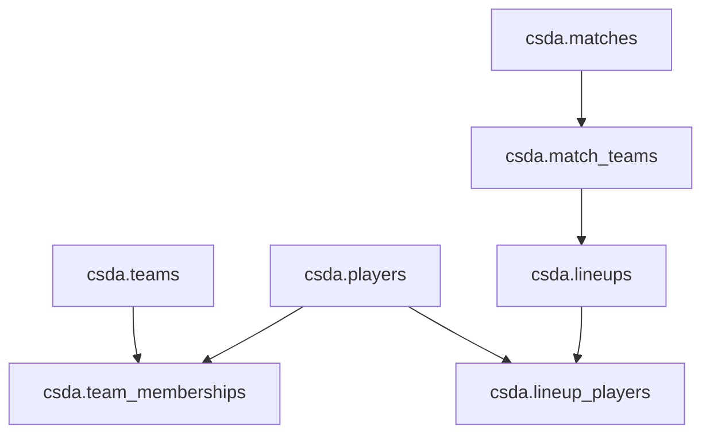
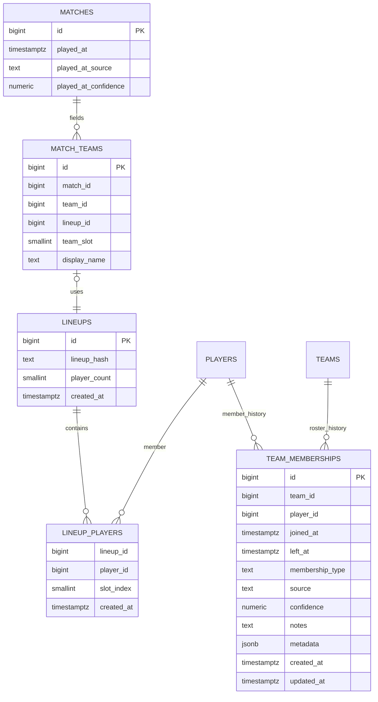

# `0003` Schema Proposal: Match Time, Lineups, and Roster History

This document proposes the **next schema iteration** after the team/context expansion in `0002_team_context.sql`.

The goal is to add the missing data model pieces needed for:

- historical roster tracking
- comparing before/after lineup changes
- identifying the actual five-player unit that played a match
- separating org/team identity from lineup identity
- laying the foundation for future role/deployment analysis

This is a **design-first** proposal.
It is not implemented yet.

---

## Why this should happen next

After `0002`, the schema now has:

- canonical teams
- match-local teams
- match classification/context

That solves an important part of the scouting model.

But it still does **not** solve a crucial question for serious analysis:

> when a team changes players, how do we compare before and after the change?

To answer that well, the schema needs three additional concepts:

1. **time**
2. **lineup identity**
3. **historical membership**

Without those, lineup-change analysis stays fuzzy and role/deployment analysis later will have weak foundations.

---

## Core design principle

For this project, these things are **not** the same:

- `team`
- `match_team`
- `lineup`
- `competitive_unit`
- `team membership`
- `role`

That distinction matters a lot.

### Team
The long-lived org or canonical team identity.

Examples:
- NAVI
- FaZe
- Spirit

### Match team
A team as it appeared in one specific match.

Examples:
- NAVI on Mirage in this demo
- a provisional T-side/CT-side team before enrichment

### Lineup
The actual set of players that played together in that match.

Examples:
- NAVI with players A/B/C/D/E
- later NAVI with A/B/C/D/F

### Competitive unit
A richer contextual identity for a lineup operating under a given team/coaching context.

Examples:
- Team Spirit
- lineup A/B/C/D/E
- coach X
- active during a specific period

This is **not proposed as part of `0003`**, but it is an important future layer.
It should be modeled separately from the base lineup identity.

### Team membership
The historical roster/archive view.

Examples:
- player joined on date X
- left on date Y
- was a stand-in for event Z

### Role
A contextual, derived interpretation of how a player was used.

Examples:
- CT B anchor
- T first contact
- late lurk
- rotator

Role should **not** be modeled yet as a static player attribute.
This proposal prepares the data model for better role work later.

---

## Design goals for `0003`

1. Add reliable **match timestamps**.
2. Add reusable **lineup identity**.
3. Connect match-local teams to the lineup they actually fielded.
4. Add **historical team membership** records with provenance and confidence.
5. Preserve a separation between:
   - factual match participation
   - inferred or enriched roster history
6. Prepare the data model for future role/deployment analysis without hardcoding simplistic roles today.

---

## Proposed schema changes

## 1. Add match time to `csda.matches`

### Why
Without a timestamp, you cannot reliably do:

- before/after roster-change analysis
- historical trend windows
- lineup-era comparisons
- transfer-impact comparisons

### Suggested new fields on `csda.matches`

- `played_at timestamptz`
- `played_at_source text`
- `played_at_confidence numeric(4,3)`

Suggested constraints:

### `played_at_source`
- `demo`
- `hltv`
- `faceit`
- `file_metadata`
- `manual`
- `unknown`

### `played_at_confidence`
- nullable
- range `0` to `1`

### Why add provenance here
A match time may come from:

- demo metadata
- HLTV event/match data
- FACEIT data
- filesystem timestamps
- manual correction

You will want to know how trustworthy the timestamp is.

---

## 2. Add `csda.lineups`

Represents a reusable lineup identity.

This is **not** the same as a team.
It is the actual player set.

### Important identity rule

For `0003`, `lineup_hash` should be based on the **sorted canonical player set only**.

In other words:
- yes: player identities belong in the lineup hash
- no: team, coach, org, or time should not be part of the lineup hash

Why:
- lineup should answer **who are the players?**
- team/coach context should be modeled separately later
- time periods should remain separate and correctable
- this keeps lineup identity stable and reusable

### Suggested fields

- `id bigserial primary key`
- `lineup_hash text not null`
- `player_count smallint not null`
- `created_at timestamptz not null default now()`

Suggested constraints:

- `unique (lineup_hash)`
- `player_count > 0`

### Notes

- `lineup_hash` should be derived from the sorted set of canonical `player_id`s.
- That makes lineups reusable and deduplicated.
- If the same five players appear again together later, they can reuse the same lineup identity.

This is useful because you may want to compare:
- same org, different lineup
- same lineup across multiple events
- same player in lineup A vs lineup B
- the same player set under different team/coaching contexts later

---

## 3. Add `csda.lineup_players`

Maps players to a lineup.

### Suggested fields

- `lineup_id bigint not null references csda.lineups(id) on delete cascade`
- `player_id bigint not null references csda.players(id) on delete cascade`
- `slot_index smallint`
- `created_at timestamptz not null default now()`

Suggested constraints:

- `unique (lineup_id, player_id)`
- optional `unique (lineup_id, slot_index)` when `slot_index` is not null

### Notes

- `slot_index` is optional and should not be confused with tactical role.
- It can be useful only for deterministic display ordering or input stability.

---

## 4. Add `lineup_id` to `csda.match_teams`

### Why
A match team should know **which lineup** it fielded.

Suggested field:

- `lineup_id bigint references csda.lineups(id)`

This allows questions like:

- how did Team X perform with lineup A vs lineup B?
- which lineup was used in this event?
- what changed after player Y joined?

This is one of the most important additions in the whole proposal.

---

## 5. Add `csda.team_memberships`

Stores historical roster/archive membership with provenance.

### Suggested fields

- `id bigserial primary key`
- `team_id bigint not null references csda.teams(id) on delete cascade`
- `player_id bigint not null references csda.players(id) on delete cascade`
- `joined_at timestamptz`
- `left_at timestamptz`
- `membership_type text not null`
- `source text not null`
- `confidence numeric(4,3)`
- `notes text`
- `metadata jsonb`
- `created_at timestamptz not null default now()`
- `updated_at timestamptz not null default now()`

Suggested enums/checks:

### `membership_type`
- `starter`
- `standin`
- `substitute`
- `trial`
- `coach`
- `academy_callup`
- `unknown`

### `source`
- `hltv`
- `manual`
- `heuristic`
- `faceit`
- `other`
- `unknown`

### `confidence`
- nullable
- range `0` to `1`

### Notes

- `joined_at` and `left_at` can be null when the exact timing is unknown.
- This table is **not** a replacement for factual match participation.
- It is the historical/archive layer, not the primary ground truth for who played a match.

---

## Two kinds of truth to preserve

This is very important.

## A. Match participation truth
This is the strongest factual layer.

Derived from:
- `match_teams`
- `match_players`
- `lineup_id`

This answers:
- who actually played this match?
- which five were on the server for this side?

## B. Membership/archive truth
This is the historical roster layer.

Derived from:
- HLTV/manual enrichment
- heuristics
- later admin corrections

This answers:
- when was a player on this team?
- was this player a stand-in or starter?
- what changed across roster eras?

You want both.
Do not collapse them into one table.

---

## Proposed relationship view

---

## Proposed ERD-style view

---

## Why lineup identity matters so much

`lineup_id` should answer one question clearly:

> **Which players made up this unit?**

It should not try to also encode:
- team/org identity
- coaching context
- tactical era
- time validity window

Those belong in separate layers.

This is the core value of `0003`.

Without lineup identity, you can ask:
- how did NAVI play over time?

But not cleanly:
- how did NAVI play **before player X joined**?
- how did NAVI play **after player X joined**?
- how did this specific five-man unit behave on Mirage CT?

`lineup_id` makes those questions much more natural.

It also helps with:
- stand-ins
- temporary substitutions
- comparing org-level changes vs lineup-level changes

---

## Future extension: competitive units

This proposal intentionally stops at lineup identity and roster history.

But the next likely contextual layer after this is something like:

## `competitive_units`

A future `competitive_unit` would likely represent:

- `team_id`
- `lineup_id`
- `head_coach_id`
- possibly other staff/context fields later

And then a future period table might represent:

## `competitive_unit_periods`

Suggested future fields:
- `competitive_unit_id`
- `valid_from`
- `valid_to`
- `source`
- `confidence`
- `notes`

This would let you model ideas like:
- same five, different coach
- same five, same coach, different team/org context
- same team and lineup across multiple eras

That is the right place to capture richer contextual identity.
It should not be overloaded into `lineup_hash`.

---

## Why this prepares the future role model

You called out something very important:

- role changes over time
- role changes by side
- role changes by map
- role changes when lineups change

That means role should **not** be modeled as a static field on `players`.

Bad:
- `players.role = 'support'`

Better future model:
- role is a derived classification tied to:
  - `player_id`
  - `lineup_id`
  - `side`
  - `map`
  - possibly a time window

### Not proposed for `0003` yet
I would **not** implement a full role schema in `0003`.

### But `0003` should make it possible later
Because with:
- `played_at`
- `lineup_id`
- `team_memberships`

…you can later build a role/deployment layer that is much more meaningful.

---

## Likely future role/deployment layer after `0003`

This is not part of the immediate migration, but it is the likely next conceptual step.

Possible future table:

## `lineup_role_assignments`

Suggested future fields:

- `id bigserial primary key`
- `lineup_id bigint not null`
- `player_id bigint not null`
- `map_name text`
- `side text`
- `role_code text not null`
- `confidence numeric(4,3)`
- `classifier_version text not null`
- `source text not null`
- `valid_from timestamptz`
- `valid_to timestamptz`
- `notes text`

This would let you express things like:

- player P in lineup L on Mirage CT was primarily a B anchor
- the same player in a different lineup became a rotator
- role burden changed after a roster move

But again: that should come **after** the time/lineup/history foundation is in place.

---

## Suggested migration strategy

### Phase A
Add the timeline fields to `matches`:
- `played_at`
- `played_at_source`
- `played_at_confidence`

### Phase B
Add lineup tables:
- `lineups`
- `lineup_players`

### Phase C
Add `match_teams.lineup_id`

### Phase D
Backfill lineups from existing match participants where possible
- build a lineup hash from the set of canonical `player_id`s under each `match_team`
- leave unresolved lineups null when player identity is incomplete

### Phase E
Add historical roster table:
- `team_memberships`

### Phase F
Later enrichment
- populate `team_memberships` from HLTV/manual/heuristic sources
- start building roster-era logic and future role models

---

## What this unlocks immediately

Once implemented, this proposal would let you do much better analysis for:

- before/after roster moves
- main roster vs stand-in lineups
- lineup-based map tendency comparisons
- player behavior under different lineups
- org-level changes vs lineup-level changes

That is exactly the kind of historical archive and comparison workflow you described.

---

## Proposed next step after this design

Once this proposal feels right, the implementation step should be:

1. create an actual `0003` migration
2. update the schema visualizer again
3. extend `csda-storage` ingest/backfill logic
4. then revisit role/deployment modeling with a stronger foundation

That keeps the system grounded in time, lineage, and roster history before moving into richer tactical interpretation.
