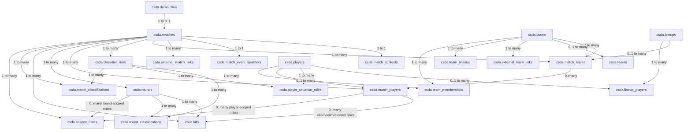

# Schema Visualizer

This document gives you a visual reference for the current `csda` database schema after the first three migrations.

It is meant to complement:

- `docs/database.md`
- `crates/csda-storage/migrations/0001_initial.sql`
- `crates/csda-storage/migrations/0002_team_context.sql`
- `crates/csda-storage/migrations/0003_lineups_roster_history.sql`

If your editor supports Mermaid rendering, these diagrams should be viewable directly from this file.

## Relationship overview



## Entity relationship detail

```mermaid
erDiagram
    DEMO_FILES ||--o| MATCHES : canonical_match
    MATCHES ||--|| MATCH_CONTEXTS : classified_as
    MATCHES ||--o| MATCH_EVENT_QUALIFIERS : qualifiers
    MATCHES ||--o{ EXTERNAL_MATCH_LINKS : provider_links
    MATCHES ||--o{ MATCH_TEAMS : has_sides
    MATCHES ||--o{ CLASSIFIER_RUNS : classifier_executions
    TEAMS ||--o{ MATCH_TEAMS : resolved_team
    TEAMS self --o{ TEAMS : parent_child_hierarchy
    LINEUPS o|--o| MATCH_TEAMS : lineup_used
    LINEUPS ||--o{ LINEUP_PLAYERS : contains
    PLAYERS ||--o{ LINEUP_PLAYERS : member
    PLAYERS ||--o{ PLAYER_SITUATION_ROLES : situational_roles
    TEAMS ||--o{ EXTERNAL_TEAM_LINKS : provider_ids
    TEAMS ||--o{ TEAM_ALIASES : aliases
    TEAMS ||--o{ TEAM_MEMBERSHIPS : roster_history
    MATCHES ||--o{ MATCH_PLAYERS : participants
    MATCHES ||--o{ MATCH_CLASSIFICATIONS : match_labels
    MATCHES ||--o{ ROUNDS : contains
    ROUNDS ||--o{ ROUND_CLASSIFICATIONS : round_labels
    MATCH_PLAYERS o|--o{ MATCH_PLAYERS : resolved_identity
    MATCH_TEAMS o|--o{ MATCH_PLAYERS : grouped_into
    ROUNDS ||--o{ KILLS : within_round
    MATCH_PLAYERS o|--o{ KILLS : player_refs
    MATCHES ||--o{ ANALYST_NOTES : annotations
    ROUNDS o|--o{ ANALYST_NOTES : round_scope
    MATCH_PLAYERS o|--o{ ANALYST_NOTES : player_scope
    CLASSIFIER_RUNS ||--o{ ROUND_CLASSIFICATIONS : run_output
    CLASSIFIER_RUNS ||--o{ PLAYER_SITUATION_ROLES : run_output
    CLASSIFIER_RUNS ||--o{ MATCH_CLASSIFICATIONS : run_output

    DEMO_FILES {
        bigint id PK
        text demo_filename
        text demo_checksum
        text parser_name
        text parser_version
        text source
        jsonb raw_metadata
        timestamptz ingested_at
    }

    MATCHES {
        bigint id PK
        bigint demo_file_id
        text map_name
        integer tick_rate
        text server_name
        text source
        jsonb canonical_match_json
        timestamptz played_at
        text played_at_source
        numeric played_at_confidence
        timestamptz created_at
    }

    MATCH_CONTEXTS {
        bigint match_id PK
        text context_provider
        text play_environment
        boolean is_structured_team_play
        smallint tier_estimate
        text analysis_pool
        text classification_source
        text classification_version
        text event_name
        numeric confidence
        text notes
        jsonb metadata
        timestamptz created_at
        timestamptz updated_at
    }

    EXTERNAL_MATCH_LINKS {
        bigint id PK
        bigint match_id
        text provider
        text external_match_id
        text linked_by
        jsonb metadata
        timestamptz created_at
    }

    TEAMS {
        bigint id PK
        text canonical_name
        text slug
        text country_code
        boolean is_provisional
        timestamptz created_at
        timestamptz updated_at
    }

    EXTERNAL_TEAM_LINKS {
        bigint id PK
        bigint team_id
        text provider
        text external_team_id
        text external_name
        jsonb metadata
        timestamptz created_at
    }

    TEAM_ALIASES {
        bigint id PK
        bigint team_id
        text alias
        text alias_normalized
        text source
        numeric confidence
        timestamptz created_at
    }

    LINEUPS {
        bigint id PK
        text lineup_hash
        smallint player_count
        timestamptz created_at
    }

    LINEUP_PLAYERS {
        bigint lineup_id
        bigint player_id
        smallint slot_index
        timestamptz created_at
    }

    TEAM_MEMBERSHIPS {
        bigint id PK
        bigint team_id
        bigint player_id
        timestamptz joined_at
        timestamptz left_at
        text membership_type
        text source
        numeric confidence
        text notes
        jsonb metadata
        timestamptz created_at
        timestamptz updated_at
    }

    PLAYERS {
        bigint id PK
        bigint steam_id
        text last_known_name
        timestamptz created_at
        timestamptz updated_at
    }

    MATCH_TEAMS {
        bigint id PK
        bigint match_id
        smallint team_slot
        bigint team_id
        bigint lineup_id
        text display_name
        text starting_side
        integer score
        boolean is_winner
        jsonb metadata
        timestamptz created_at
    }

    MATCH_PLAYERS {
        bigint id PK
        bigint match_id
        smallint match_player_index
        bigint player_id
        bigint match_team_id
        bigint steam_id
        text display_name
        text team_side
        timestamptz created_at
    }

    ROUNDS {
        bigint id PK
        bigint match_id
        integer round_number
        integer start_tick
        integer end_tick
        text winner_side
        text end_reason
        smallint score_t
        smallint score_ct
        timestamptz created_at
    }

    KILLS {
        bigint id PK
        bigint match_id
        integer round_number
        integer kill_index
        integer tick
        smallint killer_match_player_index
        text killer_name_raw
        smallint victim_match_player_index
        text victim_name_raw
        smallint assister_match_player_index
        text assister_name_raw
        text weapon_name
        boolean is_headshot
        boolean is_wallbang
        timestamptz created_at
    }

    ANALYST_NOTES {
        bigint id PK
        bigint match_id
        integer round_number
        integer tick
        smallint match_player_index
        text scope
        text author
        text title
        text body
        jsonb metadata
        timestamptz created_at
    }

    MATCH_EVENT_QUALIFIERS {
        bigint id PK
        bigint match_id FK
        text network_type
        text crowd_level
        text crowd_consistency
        text crowd_notes
        text source
        numeric confidence
        jsonb metadata
        timestamptz created_at
    }

    CLASSIFIER_RUNS {
        bigint id PK
        text classifier_name
        text classifier_version
        bigint match_id FK
        timestamptz ran_at
        jsonb metadata
    }

    ROUND_CLASSIFICATIONS {
        bigint id PK
        bigint classifier_run_id FK
        bigint round_id FK
        text label_name
        text label_value
        numeric confidence
        text notes
        jsonb metadata
    }

    PLAYER_SITUATION_ROLES {
        bigint id PK
        bigint classifier_run_id FK
        bigint player_id FK
        bigint lineup_id FK
        text map_name
        text side
        text role_code
        numeric confidence
        text notes
        jsonb metadata
    }

    MATCH_CLASSIFICATIONS {
        bigint id PK
        bigint classifier_run_id FK
        bigint match_id FK
        text label_name
        text label_value
        numeric confidence
        text notes
        jsonb metadata
    }
```

## Practical reading notes

- `demo_files` and `matches` are separate — ingestion provenance is kept distinct from canonical match data.
- `matches.played_at` is nullable — timestamps are enriched separately and can be sourced from the demo, HLTV, FACEIT, file metadata, or manually.
- `match_contexts` routes matches into analysis pools without requiring separate databases.
- `lineups` are identified by a sorted canonical player-set hash — the same five players reuse the same lineup regardless of org/team context.
- `match_teams.lineup_id` records the actual player set fielded in each match side.
- `team_memberships` is the historical roster archive layer — separate from factual match participation.
- `teams` is long-term canonical team identity; `match_teams` is match-local team representation.
- `match_players` links to both global `players` and `match_teams` for per-match grouping.
- `classifier_runs` is the foundation for versioned, rerunnable derived labels — rerunning a classifier produces new rows, old ones stay queryable.
- `player_situation_roles` encodes role as a function of (player, lineup, map, side) — not a static player property.

## Current ingest status

The current ingest path populates:

- `demo_files`
- `matches` (including `played_at` when provided via `MatchTimeInput`)
- `match_contexts`
- `players`
- `match_teams`
- `match_players`
- `rounds`
- `kills`
- `external_match_links`
- `match_event_qualifiers` (via external enrichment, not demo parsing)

Classification tables (`classifier_runs`, `round_classifications`, `player_situation_roles`, `match_classifications`) are populated by classifiers running over existing or new matches — not by the initial ingest flow.

Lineup detection runs automatically during `0003` backfill and on each subsequent ingest when player identity is fully resolved.

`teams`, `external_team_links`, `team_aliases`, `team_memberships`, and `lineups` are populated via manual curation CLI commands.

## Live browsing option

```bash
docker compose --profile tools up -d adminer
```
